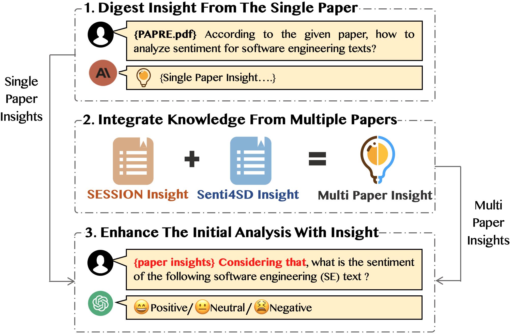

## ICSE2025

In this paper, we propose a paper-insight-enhanced prompting approach that utilizes the insights digested from SA4SE-related papers to guide ChatGPT toward better performance in this task.

**Firstly**, we attempt to guide the LLM tool to automatically digest insights from individual research papers. In this process, we explore various settings for insight digesting, including different paper contents (the dictionary (heuristic)-based approach paper SESSION vs. the learning-based approach paper Senti4SD vs. segments of SESSION), different LLM tools (the large-context Claude2 vs. the small-context ChatGPT3.5), and different insight-digesting prompt (generic vs. specialized). 

**Then**, we explore to achieve further improvements by integrating knowledge from multiple papers. Our exploration of integration methods includes: 1) Digesting insights from combined papers; 2) Directly concatenating extracted single-paper insights; 3) "*Standing on the shoulders*" (Supplementing extracted single-paper insights with contents from new papers). 

**Finally**, we employ digested insights to enhance the initial prompt for the SA4SE task.

The schematic diagram of our prompting approach is as follows:

  

Experiments have shown that posing specialized insight-digesting prompt to guide the large-context Claude2 in digesting insights from the SESSION paper which proposes a heuristic-based approach enables us to obtain the best single-paper insight. Furthermore, directly concatenating it with the single-paper insight from Senti4SD can further enhance the performance. **This best-performing paper insight can bring an average increase of 4.2% in overall accuracy and 4.6% in Macro-F compared to the initial prompt. Moreover, it can outperforms the other four SA4SE baselines on the average overall accuracy from 2.1% to 16.4%, and the average Macro-F from 4.6% to 20.8% as well, achieve the best average overall accuracy (0.817) and Macro-F (0.715) among all baseline approaches on six test sets.** (All details of the experiments can be found in the "data_analysis.xlsx" file.) Thus, we consider that our insight-enhanced prompting approach is an effective way to guide ChatGPT in understanding the characteristics of sentiment expression in SE texts and better accomplishing the SA4SE task.

## The baseline approaches used in our paper can be found in:

- [SentiStrength-SE](https://laser.cs.uno.edu/Projects/Projects.html)
- [SESSION](https://github.com/huiAlex/SESSION)
- [Senti4SD](https://github.com/collab-uniba/Senti4SD)
- [EASTER](https://github.com/xiaobo-lab/EASTER)

## The dataset used in our paper can be found in:

- One Stack Overflow dataset from [the work of Calefato et al.](https://github.com/collab-uniba/Senti4SD)
- Three datasets from [the work of Lin et al.](https://sentiment-se.github.io/replication.zip)
- One JIRA dataset from [the work of Kaur et al.](https://www.dropbox.com/sh/l4x6njr4qfy2cos/AABQjl1C7cBnRpSfaFNPyOkFa?dl=0)
- One GitHub dataset from [the work of Imtiaz et al.](https://github.com/DeveloperLiberationFront/AffectAnalysisToolEvaluation)

If you need to use the aforementioned baseline approach or datasets, you are required to comply with their respective licenses issued at the time of publication and cite the original papers.

## Project structure：

│ ├── ChatGPT/ 

│ ├────── outputs/ # The results of different insight prompts in the experiment

│ ├────── gpt_completion.py # How to configure ChatGPT API

│ ├── human_labeled/  # Test set and its manual annotation

│ ├── input/  # The pure texts of test set

│ ├── Screenshot of conversation/  # Some screenshots show how we interact with AIGC tools

│ ├── analysis_senti_for_file.py # Main program entry, used to set which prompt to complete the SA4SE tasks

│ ├── data analysis.xlsx # Detailed evaluation data for all experiments

│ ├── evaluate.py 

│ ├── explainer.py # Using a TF-IDF based logistic regression model to fit ChatGPT predictions for interpretation

│ └── prompts.py # The main file for storing insight-enhanced prompts

## How to run this project：

1. Fill in your openai.api_key in the file gptcomplete.py
2. Set the prompt you want to use for SA4SE in the analysis_senti_for_file.py

